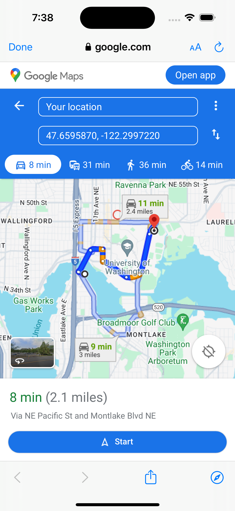

# final_project

## Name
Find your Needs

## Description
todo

## Badges
On some READMEs, you may see small images that convey metadata, such as whether or not all the tests are passing for the project. You can use Shields to add some to your README. Many services also have instructions for adding a badge.

## Visuals
### Screenshots

#### Home Page

#### Main View

#### More Info

#### Navigation Feature

## Installation
todo?

## Usage
- all in one place navigate to various public resources

## Support
email: sshahb@uw.edu for any support and any issues.

## Contributing
State if you are open to contributions and what your requirements are for accepting them.

For people who want to make changes to your project, it's helpful to have some documentation on how to get started. Perhaps there is a script that they should run or some environment variables that they need to set. Make these steps explicit. These instructions could also be useful to your future self.

You can also document commands to lint the code or run tests. These steps help to ensure high code quality and reduce the likelihood that the changes inadvertently break something. Having instructions for running tests is especially helpful if it requires external setup, such as starting a Selenium server for testing in a browser.

## Authors and acknowledgment
Sulaiman
Ha Vi
Eva
Beemnet 

## License
Reach out to support for licensing and using.

## Project status
Find Your Needs - Complete including stretch goals.

## Data Design and Data Flow
### Data Design

*   **Locations Database**: Collection of location data structures gotten from a JSON file (assets/location.json). Each location object has attributes such as name, latitude, longitude, type, and description. This data is loaded into the app on startup and is the main data structure from which map markers and list items are made and shown.
    
*   **Markers**: List of markers created based on the locations data. Each marker in the map corresponds to a location in the data, with properties such as position (latitude, longitude), icon, and info window content that displays details on tap directly on the map.

Keeping track of consistently:
- Users current location (latitude and longitude)
- Last shared preference on the map for data persistence

#### Data Flow

*   **Provider for Position and Location Data**:
    
    *   The **PositionProvider** is used to manage and show the user's current geolocation throughout the app (map current location and list for distance).        
    *   Listens for changes in the user's position using geolocation services from ios.
        
    *   When the position changes, **PositionProvider** updates the current latitude and longitude.
                
*   **Reactive Updates**:
    
    *   Changes in user location or interactions with the map (such as selecting a marker).
        
    *   Tapping on a location in the list opens a view with more details regarding that location.

    *   Ability to navigate to phones actual map app and instantly provides navigation details.
        
*   **Integration with Map API**:
    
    *   Google Maps API is used to provide a visual experience along with a list visual for users.
        
    *   Markers are put on the map based on the locations data (assets/location.json). Icons are used to differentiate between types of locations, with a legend for reference.
        
    *   Map API works with the **PositionProvider** to update the users current location marker.
        
    *   The map view reacts to user interactions such as zooming in and out and moving view to current location using the pin point button.
        
    *   App saves last known map position and zoom level to ensure data persistence, accomplished by using shared preferences for data persistence.

## Resources Used
Ben Shapiro, CSE 340 Staff and Eva's code from Food Finder Assigment. https://gitlab.cs.washington.edu/cse340-24spring-students/4_food_finder-evaliu02  
https://stackoverflow.com/questions/49959617/flutter-how-do-you-make-a-card-clickable  
Ben Shapiro, CSE 340 Staff and Eva's code from Journal Assignment. https://gitlab.cs.washington.edu/cse340-24spring-students/5_journal-evaliu02  
https://dart.dev/language/branches#switch-statements  
Google Maps  
